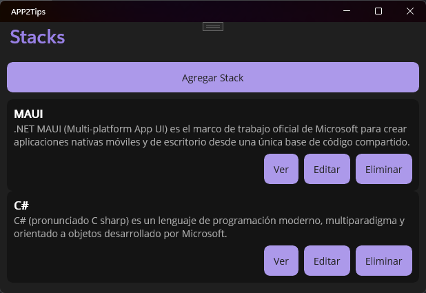
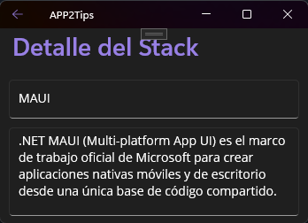
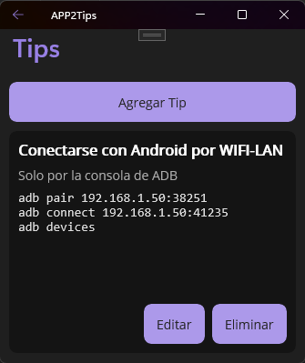
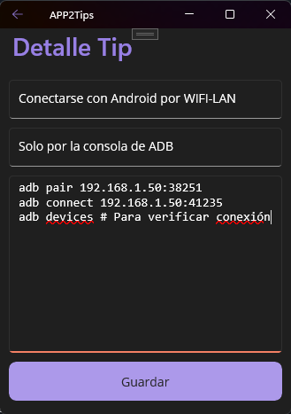
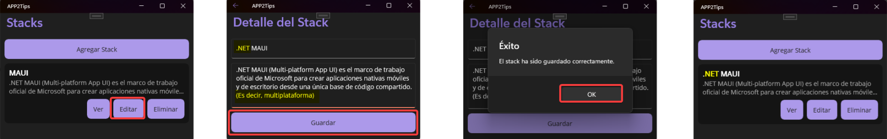
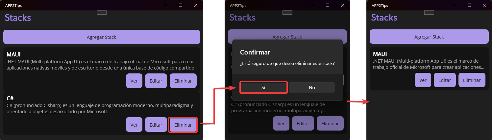
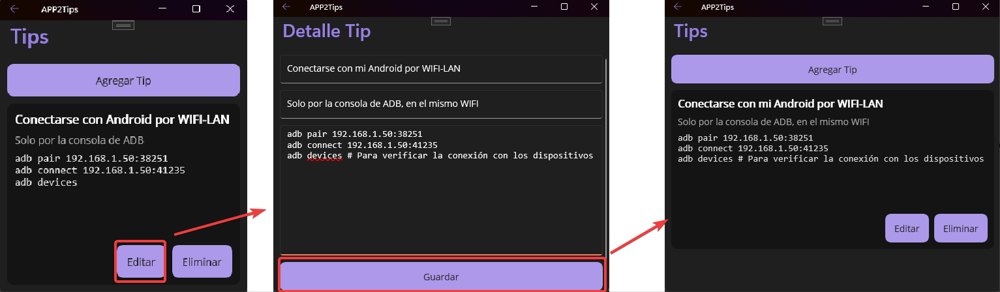
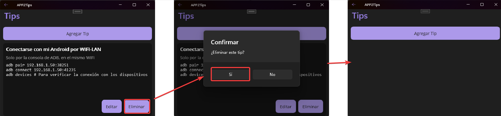

# Tips Personales de Stacks — Diccionario personal de tips por Stack Tecnológico

APP2Tips es una aplicación .NET MAUI para guardar, organizar y consultar "tips" (fragmentos de comandos o código, atajos y notas) asociados a distintos stacks tecnológicos (por ejemplo: MAUI, C#, JavaScript, Python, etc.). La idea es permitir al desarrollador conservar recordatorios prácticos por tecnología y consultarlos rápidamente desde el móvil o escritorio.

> Esta guía describe la finalidad, la estructura y el flujo de la aplicación.

## Objetivo

- Guardar tips por Stack: cada stack (StackTech) tiene nombre y descripción.
- Cada tip tiene título, descripción corta y el contenido (código/command) que se desea guardar.
- Consultar, crear, editar y eliminar stacks y tips (operaciones CRUD).

## Flujos principales (resumen)

- Pantalla principal: listado de Stacks (tarjetas). Cada tarjeta muestra nombre, descripción corta y acciones (ver, editar, eliminar). Al tocar la tarjeta se abre la lista de tips del stack.

- Pantalla de detalle del Stack: visualiza la información del stack y lista de tips asociados (tarjetas pequeñas). Desde aquí se puede agregar un tip nuevo.

- Pantalla de lista de Tips: muestra los tips en tarjetas oscuras; la previsualización muestra el título (1 línea), la descripción (máx. 3 líneas con puntos suspensivos) y un bloque de código con espacio suficiente para leer el snippet.

- Pantalla de detalle/edición de Tip: formulario para título, descripción y editor de código. Guardar regresa a la lista.

## Ejemplo de uso

1. Creo un Stack llamado "MAUI" con descripción breve.

2. En caso de error se puede editar el stack.

3. Si necesita, puede borrar el stack.

4. Dentro del stack creo un tip titulado "Instalar plantilla MAUI" con una descripción corta y en Código escribo comandos (por ejemplo: dotnet new maui -n MiApp).

5. En caso de error se puede editar el tip.

6. Si necesita, puede borrar el tip.

## Estructura del proyecto (relevante para desarrolladores)

- APP2Tips/Entities
  - StackTech.cs — entidad del stack (ID, NombreStack, DescripcionStack)
  - Tip.cs — entidad del tip (ID, StackTechID, TituloTip, DescripcionTip, CodigoTip)
- APP2Tips/Managers
  - StackTechs.cs — acceso a datos (SQLite + Dapper) para StackTech (CRUD)
  - Tips.cs — acceso a datos (SQLite + Dapper) para Tip (CRUD)
- APP2Tips/Pages
  - StackTechListPage.xaml(.cs) — lista de stacks
  - StackTechDetailPage.xaml(.cs) — crear/ver/editar stack
  - Pages/Tips/TipsListPage.xaml(.cs) — lista de tips de un stack
  - Pages/Tips/TipDetailPage.xaml(.cs) — crear/ver/editar tip

## Requisitos y ejecución

- .NET 10 SDK
- Visual Studio 2022/2026 con carga de proyectos .NET MAUI
- Restaurar paquetes NuGet (Dapper, Microsoft.Data.Sqlite)

Abrir la solución en Visual Studio, establecer proyecto de inicio APP2Tips y ejecutar (F5). La navegación usa Shell; las páginas se comunican vía rutas y QueryProperties.

## Notas para UI

- Las tarjetas de Stack usan fondo oscuro y texto claro para mantener coherencia con el tema (tarjetas de tips también son oscuras). Los textos importantes (títulos) se muestran en una línea, las descripciones se recortan con puntos suspensivos (MaxLines configurado).
- El bloque de código del tip está dentro de un ScrollView con fuente monoespaciada (ej. Consolas) y altura fijada para previsualización.